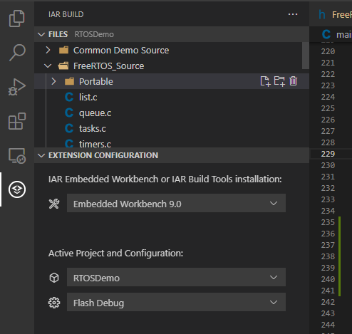

# IAR Build

Build and develop your IAR Embedded Workbench projects from Visual Studio Code.

* Build projects
* Manage project files
* Generate C-STAT messages and reports
* Use language features powered by the [C/C++ extension](https://marketplace.visualstudio.com/items?itemName=ms-vscode.cpptools)

An IAR Embedded Workbench or IAR Build Tools installation is required to use this extension.

> 💡️ To debug your Embedded Workbench projects from VS Code, please also see the [IAR C-SPY Debug extension]().

## Getting started
To get started, open a folder containing an IAR Embedded Workbench project.
A view with an IAR Embedded Workbench icon will appear in the left side panel:

Here you may select the desired IAR Embedded Workbench/Build Tools installation,
and the project and project configuration you want to work with. If your IAR Embedded Workbench or IAR Build Tools installation
is not found automatically, please see [Adding IAR Embedded Workbench/Build Tools installations]().

To build or analyze the selected project configuration, go to `Terminal->Run Task...` and then select either the `iar` or `iar-cstat` category.
To make this easier, you may wish to [Add a default build task]().

## Documentation
* [Building projects and running C-STAT]()
    * [Configuring build parameters]()
* [Adding and removing project files]()
* [Handling IAR language extensions]()
* [Adding IAR Embedded Workbench/Build Tools installations]()
* [Productivity tips]()

[Click here]() to view the full documentation.

## Compatibility
This table helps you finding the extension version supporting your specific IAR Embedded Workbench (EW) or IAR Build Tools version (BX). 
> 💡️ To use an earlier version of the extension, use a download link in the table below and install the extension manually in the **Extensions** view via `Install Another Version...`. 

IAR EW/BX - Compatibility table

| IAR EW/BX version  | Extension version | Comment
|--------------|-----------|---------
| EWARM 8.10 or later  EWRX 3.10 or later  EWRL78 3.10 or later  | (current)  | (automatically installed) |
| EWARM 7.10      | [1.0](iar-vsc-1.0.vsix) | 

## Feedback
Depending on which feedback you want to share with us, here are the preferred options:
* If you have ideas on how to improve this extension or if you have found issues with it, see [contributing.md](https://www.iar.com/knowledge/support/) on how to proceed.

* If you have issues with the underlying IAR Embedded Workbench or IAR Built Tools product, report this via the IAR Systems technical support channel at [IAR Technical Support](https://www.iar.com/knowledge/support/).

<!-- ## Contributions
Contributions are always welcome. Or did we decide to have a read-only repository? -->
