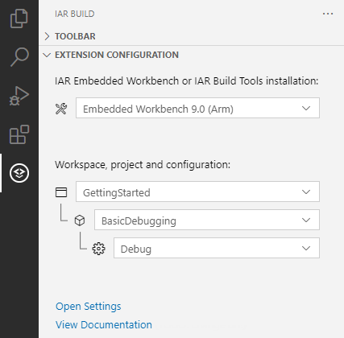
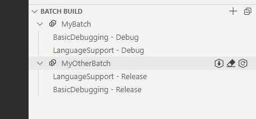
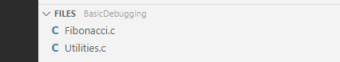
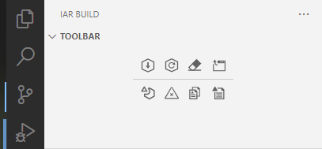

# IAR Build&mdash;Building projects and running C-STAT

This extension lets you write and edit source code and provides tasks for performing build operations on an existing IAR Embedded Workbench project. New projects cannot be created using the IAR Build extension for Visual Studio Code.

Error messages are displayed in the Terminal panel underneath the editor.

## Table of contents

* [Configuring the Build extension](#ConfigExtension)

* [Making IAR Build settings](#iarbuildsettings)

* [Switching between VS Code and IAR Embedded Workbench](#SwitchingVSCodeEW)

* [Adding and removing source files](#AddingRemovingFiles)

* [IAR Build tasks](#IARBuildTasks)

* [Configuring build parameters](#ConfigBuildParameters)

* [IAR language extensions](#IARLanguageExtensions)

<h2 id ="ConfigExtension">Configuring the Build extension</h2>

To use the IAR Build extension, you must make some initial configuration settings.

### Selecting working directory, IAR toolchain, and workspace

To select the Embedded Workbench workspace and project to work with, choose **File>Open Folder** and navigate to your working directory and select that folder.

* To select the IAR Embedded Workbench or IAR Build Tools installation, choose it from the dropdown menu under **IAR Embedded Workbench or IAR Build Tools installation**.

&nbsp;&nbsp;&nbsp;&nbsp;&nbsp;&nbsp;&nbsp;&nbsp;&nbsp;&nbsp;&nbsp;&nbsp;&nbsp;&nbsp;&nbsp;&nbsp;

* To select the workspace, project, and build configuration, choose them from the dropdown menus under **Workspace, project and configuration**. If no workspace is selected, the Project dropdown menu contains all projects (`.ewp`) found in the active directory.

* IAR Embedded Workbench supports global and workspace-local custom argument variables. The argument variables that have been defined in the selected workspace (using the IAR Embedded Workbench IDE) are available to the IAR Build extension. For more information, see the *IAR Embedded Workbench IDE Project Management and Building Guide* (PDF).

### Batch build

The selected workspace is used for loading and saving batch builds. This concept is described in the *IAR Embedded Workbench IDE Project Management and Building Guide* (PDF).

&nbsp;&nbsp;&nbsp;&nbsp;&nbsp;&nbsp;&nbsp;&nbsp;&nbsp;&nbsp;&nbsp;&nbsp;&nbsp;&nbsp;&nbsp;&nbsp;

To add a batch, click the plus icon. To remove or edit it, right-click it. Drag the batches to reorder them. The icons shown when you hover over a batch will Build, Clean, or Rebuild the batch.

All changes you make are saved in the workspace file (`.eww`), provided your version of IAR Embedded Workbench is recent enough. If the version number of **IAR Embedded Workbench shared components** is 9.1.1. or later (in the IDE, choose **Help>About>Product Info** to see this information), your version of IAR Embedded Workbench is recent enough.

### Viewing the source files

To view the source files of the project, select the IAR Build icon in the Activity Bar. The source files are displayed in the **Files** view of the Side Bar.

&nbsp;&nbsp;&nbsp;&nbsp;&nbsp;&nbsp;&nbsp;&nbsp;&nbsp;&nbsp;&nbsp;&nbsp;&nbsp;&nbsp;&nbsp;&nbsp;

### Adding IAR Embedded Workbench/Build Tools installations

On a PC running Windows, the IAR Build extension automatically finds IAR Embedded Workbench and IAR Build Tools installations. If you are using Linux or you have moved an installation from where it was originally installed, you might have to manually add it to IAR Build by choosing **Add toolchain** from the dropdown menu under **IAR Embedded Workbench or IAR Build Tools installation**.

### Shortcut keys for changing project and configuration

To quickly change the active project or configuration, use the commands on the command palette. Press F1 or Ctrl+Shift+P and start typing `IAR` to find **IAR: Select Project** or **IAR: Select Configuration**.

<h2 id="iarbuildsettings">Making IAR Build settings</h2>

To make settings for IAR Build, choose **File>Preferences>Settings** and select the **Extensions** category in the side pane of the **Settings** view, and locate **IAR Build** in the list of extensions. There is also a shortcut link to the **Settings** view in the VS Code Side Bar when IAR Build is the active extension.

For every setting, you can click on the cog wheel to the right of the setting name to reset the setting to its factory setting, copy the setting ID, or copy the setting in JSON format.

Each setting has a short description. For information about the **Extra Build Arguments**, see the documentation for `iarbuild.exe` in the *IAR Embedded Workbench IDE Project Management and Building Guide* (PDF).

**Note:** Project settings cannot be cannot be made from VS Code, they must be made in the IAR Embedded Workbench IDE.

<h2 id="SwitchingVSCodeEW">Switching between VS Code and IAR Embedded Workbench</h2>

To switch from VS Code to IAR Embedded Workbench, run the task **iar: Open Workspace in IAR Embedded Workbench**, see [Build tasks](#tasksbuildtasks).

To switch from IAR Embedded Workbench to VS Code, add a custom command to the IAR Embedded Workbench **Tools** menu:

1. In the IAR Embedded Workbench IDE, choose **Tools>Configure Tools** to open the **Configure Tools** dialog box. Click **New** if you already have custom tools commands.

2. Set the **Menu Text** to `Open in V&S Code`.

3. By default, VS Code is installed in `\AppData\Local\Programs\Microsoft VS Code`. Based on this, set the **Command** to (using a Windows standard environment variable):

    `$_localappdata_$\Programs\Microsoft VS Code\Code.exe`

4. Set the **Argument** to `$WS_DIR$ -g $FILE_PATH$:$CUR_LINE$` and click **OK**.

You can now open the current file and line in VS Code at any time by choosing **Tools>Open in VS Code**.

<h2 id="AddingRemovingFiles">Adding and removing source files</h2>

Adding and removing source files in the project is straightforward. The **Files** view in the Side Bar has icons when you hover in it with the mouse pointer, to let you add files or groups of files, and remove files/groups from the project. To reload the project, click on the ellipsis (...) and choose **Reload project**.

<h2 id="IARBuildTasks">IAR Build tasks</h2>

Most of the functionality in the IAR Build extension is implemented in the form of tasks to run. They are available from the **Terminal>Run Task** submenu, or from the toolbar at the top of the Side Bar.

&nbsp;&nbsp;&nbsp;&nbsp;&nbsp;&nbsp;&nbsp;&nbsp;&nbsp;&nbsp;&nbsp;&nbsp;&nbsp;&nbsp;&nbsp;&nbsp;

<h3 id="tasksbuildtasks">Build tasks</h3>

To run one of the *build* tasks that are available in the IAR Build extension, choose **Terminal>Run Task>iar**. These tasks are available:

* **Build Project**

    Brings the project's selected build configuration up to date by compiling, assembling, and linking the files that have changed since the last build.

* **Clean Project**

    Removes any intermediate and output files.

* **Open Workspace in IAR Embedded Workbench**

    Opens an IAR Embedded Workbench workspace file in the folder that is currently open in VS Code. If the folder contains several workspace files, you will be prompted to select which one to open.

* **Rebuild Project**

    Rebuilds and relinks all files in the project's selected build configuration.

### C-STAT tasks

To run one of the *C-STAT Static Analysis* tasks that are available in the IAR Build extension, choose **Terminal>Run Task>iar-cstat**. These tasks are available:

* **Clear C-STAT Diagnostics**

    Deletes the C-STAT output directory for the project and removes all C-STAT messages from the **Problems** view. For more information, see the *C-STAT® Static Analysis Guide* (PDF).

* **Generate Full HTML Report**

    Generates a full report in HTML format in the C-STAT output directory, based on the analysis. For more information, see the *C-STAT® Static Analysis Guide* (PDF).

* **Generate HTML Summary**

    Generates a summary of the analysis in HTML format in the C-STAT output directory. For more information, see the *C-STAT® Static Analysis Guide* (PDF).

* **Run C-STAT Analysis**

    Analyzes the project using C-STAT and generates information about the number of messages. The information is printed in the **Problems** view. For more information, see the *C-STAT® Static Analysis Guide* (PDF).

### Setting a default IAR Build task

To avoid having to choose **Terminal>Run Task>iar** or **iar-cstat** every time you want to perform an IAR Build task, you can configure a default task to execute with a keyboard shortcut (by default Ctrl+Shift+B). To set up a default build task, choose **Terminal>Configure Default Build Task** and select the task.

<h2 id="ConfigBuildParameters">Configuring build parameters</h2>

By default, the provided tasks will use the currently selected project and configuration. If you want to set up tasks to build a specific project or configuration, you can configure one or more custom tasks as described in the section *Customizing auto-detected tasks* in the VS Code User Guide.

This is an example `tasks.json` file with a configured Build Project task:

```json
{
    "version": "2.0.0",
    "tasks": [
        {
            "type": "iar",
            "command": "build",
            "project": "${workspaceFolder}/MyProject.ewp",
            "config": "*",
            "builder": "${command:iar-config.toolchain}/common/bin/iarbuild.exe",
            "label": "Build MyProject",
            "extraBuildArguments": [
                "-parallel",
                "8"
            ],
            "problemMatcher": [
                "$iar-cc",
                "$iar-linker"
            ]
        }
    ]
}
```

Running this task will build all configurations for the `MyProject.ewp` file in the workspace folder.

Information on the fields is available by means of autocompletion and tooltips.

<h2 id="IARLanguageExtensions">IAR language extensions</h2>

The IAR Build extension relies on the VS Code C/C++ extension for code indexing and real-time diagnostics. Because the VS Code C/C++ extension does not support IAR language extensions, code that uses such language features can be incorrectly parsed or display false errors. To work around this problem, the IAR Build extension uses preprocessor macros that force the indexer to ignore some extended keywords.

To define additional macros, visible only to the indexer, open the IAR Build settings as described under [Making IAR Build settings](#iarbuildsettings) and click on **Edit in settings.json** under **Defines**.

The `@` operator is especially problematic, because it is not a valid identifier and cannot be defined as a macro. To avoid errors, you can rewrite expressions using `#pragma location` instead:

```c
// Instead of:
struct {
 ...
} my_struct @ 0x1234;

// Write:
#pragma location=0x1234
struct {
 ...
} my_struct;
```

If you cannot refactor the code (for example because the `@` operator is used in your device headers), set **Error Squiggles** to **Disabled** in the VS Code C/C++ extension and rely on diagnostics from the IAR Build tasks instead.
